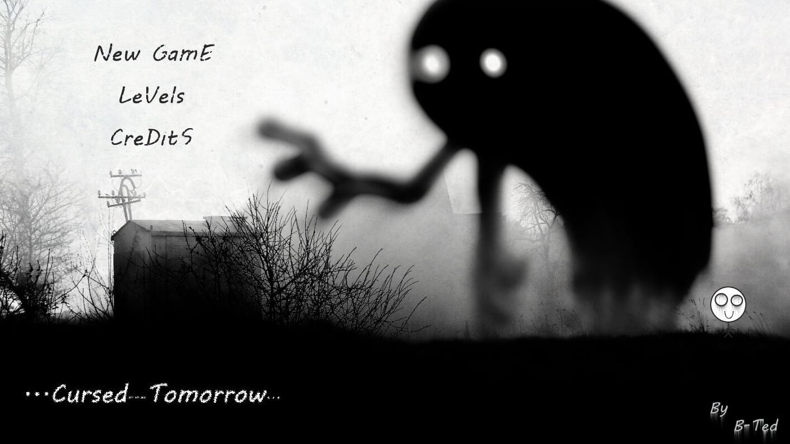
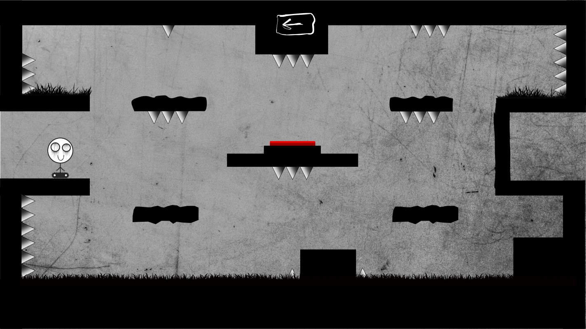
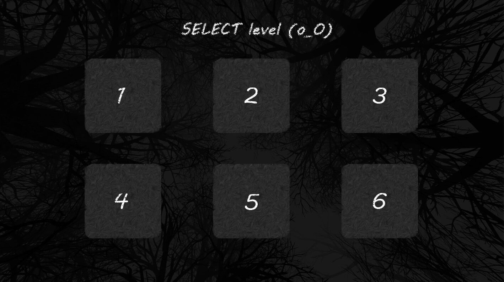
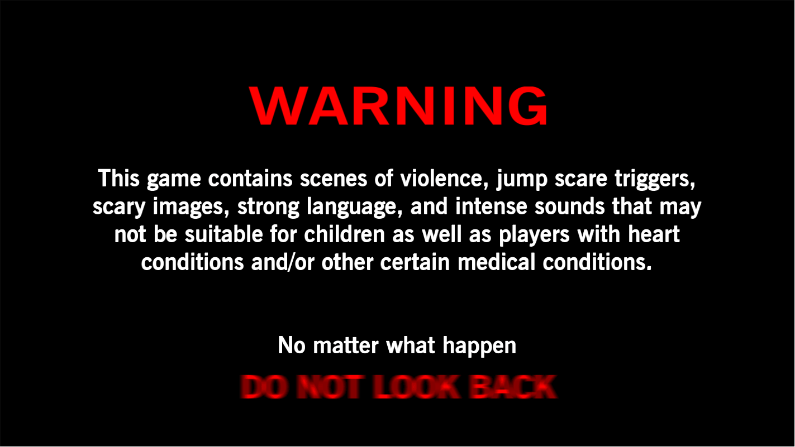
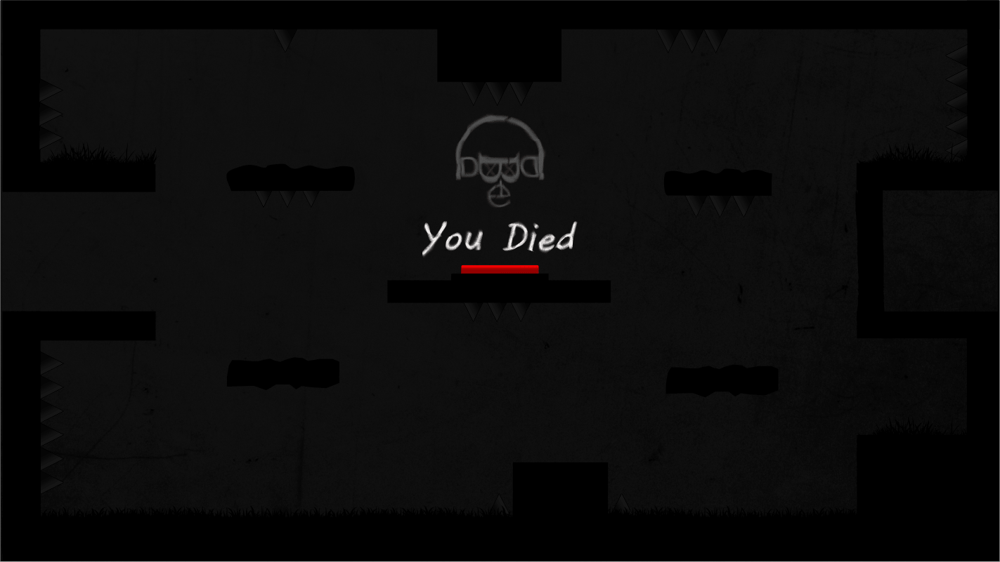
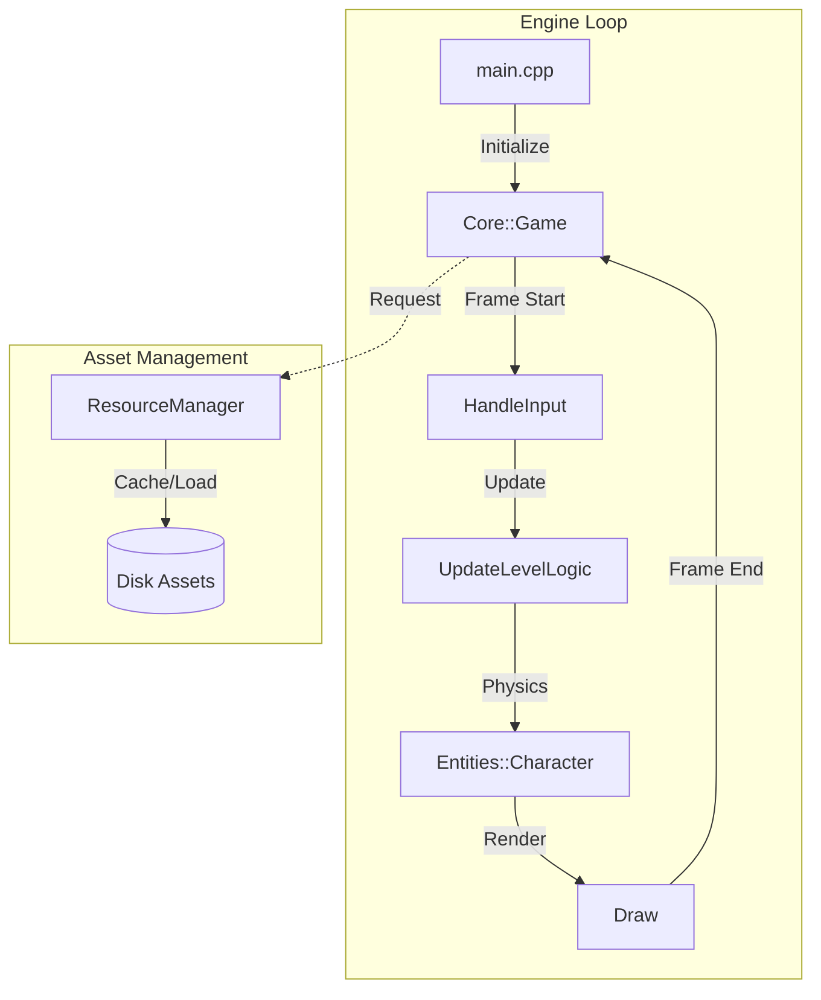
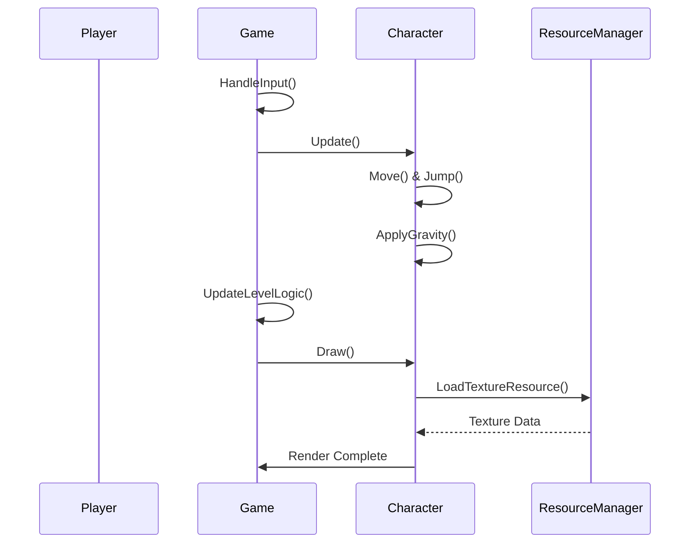
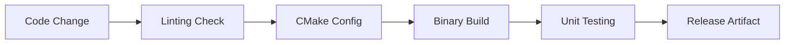

<div align="center">

# 🕯️ Cursed Tomorrow
### A platforming descent into the atmospheric unknown.

[](https://github.com/AhmadHassan-BTed/Cursed-Tomorrow/actions)
[](LICENSE)
[](CHANGELOG.md)
[](https://en.cppreference.com/w/cpp/17)
[](https://www.raylib.com/)

---

*Cursed Tomorrow* is not just a game; it is a manifestation of tension and the human struggle against an encroaching, atmospheric darkness. Designed and engineered by **Ahmad Hassan (B-Ted)**, this project serves as a technical showcase of modular C++ game design and atmospheric storytelling through interaction.

[Overview](#overview) • [Showcase](#-visual-showcase) • [Architecture](#architecture) • [Systems](#systems) • [Resources](#-academic-resources) • [Development](#development)

</div>

## 🌑 Overview

The core of *Cursed Tomorrow* lies in its simplicity and the weight of its atmosphere. Every movement, jump, and collision is tuned to resonate with the player's experience of navigating a world that feels both fragile and hostile.

### Core Pillars
- **Atmospheric Isolation**: A world designed to feel empty yet occupied.
- **Precision Mechanics**: Character movement that respects physics and player intent.
- **Modular Design**: A robust C++ foundation built for extensibility and performance.

---

## 🖼️ Visual Showcase

<div align="center">

**The World of Tomorrow**

*The gateway into the descent.*

<br>

| Gameplay | Level Selection |
| :---: | :---: |
|  |  |
| *Navigating the void.* | *Choosing the path.* |

| Atmosphere | Death |
| :---: | :---: |
|  |  |
| *Signs of what's to come.* | *The inevitable end.* |

</div>

---

## 🏗️ Architecture Documentation

The project architecture prioritizes decoupling and clear ownership. It is built to scale from a simple prototype to a complex production-grade game.

### High-Level System Flow



### Module Relationship

The interaction between modules is strictly managed through the `CursedTomorrow` namespace.

| Module | Responsibility | Internal Coupling |
| :--- | :--- | :--- |
| **Core** | Window lifecycle, state machine, and main loop orchestration. | High (Orchestrator) |
| **Entities** | Individual game actors, physics, and local state. | Low (Independent) |
| **Resources** | Centralized asset caching and memory safety. | Zero (Utility) |
| **Config** | Global constants and engine parameters. | Static Only |

---

## ⚙️ Internal Systems

### Request & Data Flow
The data flow follows a strict unidirectional pattern during the update phase to ensure deterministic behavior.



### Repository Structure

```text
.
├── .github/              # CI/CD Workflows & Templates
├── assets/               # Game Resources (Audio, Textures)
│   ├── audio/            # Atmospheric soundscapes
│   └── mainScreen/       # Visual interface components
├── docs/                 # Detailed Technical Documentation
├── include/              # Header Files
│   └── CursedTomorrow/   # Project Namespace
│       ├── Core/         # Engine & State Logic
│       └── Entities/     # Actor definitions
├── src/                  # Implementation Files
├── scripts/              # Automation and build helpers
└── CMakeLists.txt        # Build System Configuration
```

---

## 🛠️ Development Workflow

The development process is designed to be contributor-friendly while maintaining high engineering standards.

<details>
<summary><b>1. Environment Setup</b></summary>

Ensure a C++17 compiler and CMake (3.15+) are installed. Raylib is the primary dependency and can be automatically fetched during the build process.
</details>

<details>
<summary><b>2. Build Pipeline</b></summary>

```bash
# Configure with external Raylib fetch
cmake -B build -D FETCH_RAYLIB=ON

# Build the project
cmake --build build --config Release

# Run Unit Tests
ctest --test-dir build
```
</details>

### Technical Pipeline



---

## 📚 Academic Resources

This project is supported by extensive documentation and presentation materials detailing its design and theoretical foundations.

| Resource | Description | Format |
| :--- | :--- | :---: |
| **SRS Document** | Software Requirements Specification and Data Structures (DSA) concepts. | [PDF](docs/resources/SRS_Document.pdf) |
| **DSA Presentation** | Technical walkthrough of the concepts implemented in Cursed Tomorrow. | [PPTX](docs/resources/DSA_Presentation.pptx) |

---

## 🌑 Credits & Vision

This project is a solo endeavor by **Ahmad Hassan (B-Ted)**. It represents a commitment to clean code, intentional design, and the pursuit of digital atmosphere.

- **Lead Engineer**: [Ahmad Hassan (B-Ted)](https://github.com/AhmadHassan-BTed)
- **Framework**: Raylib (Special thanks to the community)
- **Vision**: To create a space where code and human emotion intersect.

New people are welcomed to explore, contribute, and fork. The goal is to build a community around intentional game engineering.

---

<div align="center">
    <i>"Tomorrow is coming, but it might be cursed."</i>
</div>
