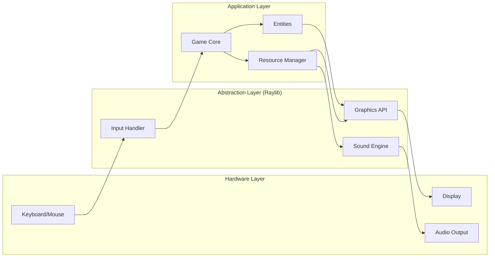

# System Design Documentation

## 1. High-Level Design

Cursed Tomorrow is a single-process application built on top of the Raylib multimedia library. It utilizes a centralized game loop that coordinates input processing, physics simulation, and frame rendering.

## 2. Component Diagram

## 3. State Machine Design

The game uses a finite state machine (FSM) to manage transitions between different scenes:

| State | Transitions To | Trigger |
|-------|----------------|---------|
| MainScreen | Level1, LevelSelect, Credits | Button Click |
| LevelSelect | MainScreen, LevelX | Back/Level Button |
| LevelX | YouDied, LevelX+1, GameEnd | Collision / Goal |
| YouDied | MainScreen | Back Button |

## 4. Scalability Considerations

- **Asset Management**: The `ResourceManager` allows adding hundreds of assets without slowing down the system by only loading them once.
- **Level System**: (Planned) Transition from hardcoded drawing to data-driven levels (JSON/XML) for easier content creation.
- **Performance**: Targeting a stable 60 FPS with minimal CPU/GPU overhead.
